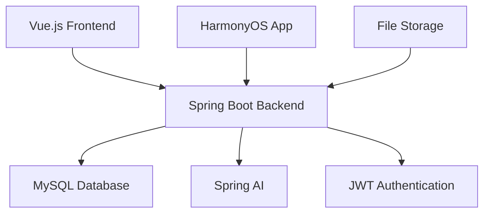

<div align="center">

# 🍵 TeaTeach Learning Management System

*A comprehensive AI-powered learning management platform*

[](https://www.oracle.com/java/)
[](https://spring.io/projects/spring-boot)
[](https://vuejs.org/)
[](https://element-plus.org/)
[](LICENSE)


[English](#english) | [中文](#中文)

</div>

---

## 🌟 Overview

TeaTeach is a modern, AI-enhanced Learning Management System that combines the power of Spring Boot backend with an intuitive Vue.js frontend. Designed for educational institutions and corporate training, it provides comprehensive tools for course management, student tracking, and intelligent analytics.

## 📊 Project Stats

<div align="center">

| Metric | Value |
|--------|-------|
| 📁 **Total Files** | 200+ |
| 💻 **Lines of Code** | 15,000+ |
| 🏗️ **Architecture** | Microservices |
| 🤖 **AI Features** | Spring AI Integration |
| 🌐 **Internationalization** | Multi-language Support |
| 📱 **Mobile Support** | HarmonyOS App |

</div>

## 🏗️ Architecture



## 🚀 Quick Start

### Prerequisites

- ☕ Java 17+
- 🟢 Node.js 16+
- 🐬 MySQL 8.0+
- 📦 Maven 3.6+

### 🔧 Installation

1. **Clone the repository**
   ```bash
   git clone https://github.com/icbitic/TeaTeach.git
   cd TeaTeach
   ```

2. **Backend Setup**
   ```bash
   # Configure database in application.yml
   # Run the backend
   ./mvnw spring-boot:run
   ```
   🌐 Backend will be available at: `http://localhost:12345`

3. **Frontend Setup**
   ```bash
   cd web
   npm install
   npm run serve
   ```
   🌐 Frontend will be available at: `http://localhost:8081`

## 🛠️ Technology Stack

### Backend
| Technology | Version | Purpose |
|------------|---------|----------|
| ☕ Java | 17 | Core Language |
| 🍃 Spring Boot | 3.5.3 | Framework |
| 🔐 Spring Security | Latest | Authentication |
| 🗃️ MyBatis | Latest | ORM |
| 🐬 MySQL | 8.0+ | Database |
| 🤖 Spring AI | Latest | AI Features |
| 🔑 JWT | 0.12.5 | Token Management |

### Frontend
| Technology | Version | Purpose |
|------------|---------|----------|
| 💚 Vue.js | 3.2.13 | Framework |
| 🎨 Element Plus | 2.4.3 | UI Components |
| 🌐 Axios | 1.6.2 | HTTP Client |
| 🧭 Vue Router | 4.0.3 | Routing |
| 📦 Vuex | 4.0.0 | State Management |
| 🌍 Vue I18n | 9.14.4 | Internationalization |
| 📊 Chart.js | 4.5.0 | Data Visualization |

## ✨ Features

### 🎓 Core Learning Features
- 👤 **User Management** - Registration, authentication, profile management
- 📚 **Course Management** - Create, edit, and organize courses
- 📝 **Assignment System** - Task creation and submission tracking
- 📁 **Resource Library** - File management and sharing
- 📊 **Progress Tracking** - Real-time student progress monitoring

### 🤖 AI-Powered Features
- 🧠 **Knowledge Mapping** - AI-driven knowledge point analysis
- 📈 **Grade Analytics** - Intelligent performance insights
- 🎯 **Personalized Learning** - Adaptive learning paths
- 💬 **AI Assistant** - Automated student support

### 🌐 Platform Features
- 🌍 **Multi-language Support** - Chinese and English
- 📱 **Mobile App** - HarmonyOS native application
- 🔒 **Security** - JWT-based authentication
- 📊 **Analytics Dashboard** - Comprehensive reporting

## 📱 Mobile Application

TeaTeach includes a native HarmonyOS application located in the `harmonys_5/` directory, providing:
- 📱 Native mobile experience
- 🔄 Offline synchronization
- 📸 Camera integration for assignments
- 🔔 Push notifications

## 🌍 Internationalization

The application supports multiple languages:
- 🇨🇳 **Chinese (Simplified)** - Default
- 🇺🇸 **English** - Full support
- 🔧 **Extensible** - Easy to add new languages

## 📚 API Documentation

When the backend is running, comprehensive API documentation is available at:
- 📖 **Swagger UI**: `http://localhost:12345/swagger-ui.html`
- 📋 **OpenAPI Spec**: `http://localhost:12345/v3/api-docs`

## 🚀 Deployment

For production deployment instructions, see [DEPLOYMENT.md](DEPLOYMENT.md)

### 🐳 Docker Support
```bash
# Build and run with Docker Compose
docker-compose up -d
```

## 🤝 Contributing

We welcome contributions! Please see our [Contributing Guidelines](CONTRIBUTING.md) for details.

### 📋 Development Workflow
1. 🍴 Fork the repository
2. 🌿 Create a feature branch
3. 💻 Make your changes
4. ✅ Run tests
5. 📤 Submit a pull request

## 📄 License

This project is proprietary and confidential. All rights reserved.

## 📞 Support

For support and questions:
- 📧 Email: support@TeaTeach.com
- 📖 Documentation: [Wiki](https://github.com/icbitic/TeaTeach/wiki)
- 🐛 Issues: [GitHub Issues](https://github.com/icbitic/TeaTeach/issues)

---

<div align="center">

## 中文

# 🍵 TeaTeach 学习管理系统

*全面的AI驱动学习管理平台*

</div>

## 🌟 概述

TeaTeach 是一个现代化的AI增强学习管理系统，结合了Spring Boot后端的强大功能和直观的Vue.js前端。专为教育机构和企业培训设计，提供课程管理、学生跟踪和智能分析的综合工具。

## 🏗️ 项目结构

该项目由以下主要组件组成：

1. **🔧 后端 (Spring Boot)** - 位于根目录
2. **🎨 前端 (Vue.js)** - 位于 `/web` 目录  
3. **📱 移动应用 (HarmonyOS)** - 位于 `/harmonys_5` 目录

## 🚀 快速开始

### 🔧 后端运行

```bash
# 使用 Maven 运行
./mvnw spring-boot:run
```

🌐 后端服务器将在 `http://localhost:12345` 启动

### 🎨 前端运行

```bash
# 导航到 web 目录
cd web

# 安装依赖项
npm install

# 启动开发服务器
npm run serve
```

🌐 前端开发服务器将在 `http://localhost:8081` 启动

## ✨ 主要功能

### 🎓 核心学习功能
- 👤 **用户管理** - 注册、认证、个人资料管理
- 📚 **课程管理** - 创建、编辑和组织课程
- 📝 **作业系统** - 任务创建和提交跟踪
- 📁 **资源库** - 文件管理和共享
- 📊 **进度跟踪** - 实时学生进度监控

### 🤖 AI驱动功能
- 🧠 **知识点映射** - AI驱动的知识点分析
- 📈 **成绩分析** - 智能性能洞察
- 🎯 **个性化学习** - 自适应学习路径
- 💬 **AI助手** - 自动化学生支持

## 📚 API 文档

后端运行时，API 文档可在以下地址获取：
- 📖 **Swagger UI**: `http://localhost:12345/swagger-ui.html`
- 📋 **OpenAPI 规范**: `http://localhost:12345/v3/api-docs`

## 🌍 国际化支持

应用程序支持多种语言：
- 🇨🇳 **中文（简体）** - 默认语言
- 🇺🇸 **英语** - 完整支持
- 🔧 **可扩展** - 易于添加新语言

## 📄 许可证

本项目为专有和机密项目。保留所有权利。

---

<div align="center">

**Made with ❤️ by the TeaTeach Team**

⭐ Star us on GitHub if you find this project useful!

</div>
